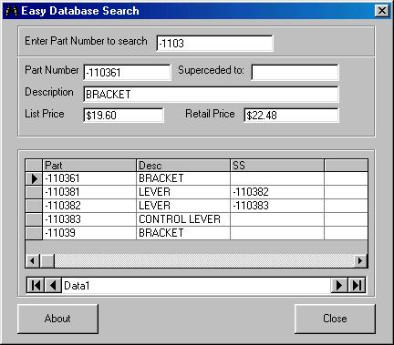



## Database Search Example

### Description

An easy example of Searching for records in a database. I posted this code last year without an example so here it is.
 
### More Info
 

             |
---                |---
**Submitted On**   |2000-04-16 15:02:02
**By**             |[N/A](https://github.com/Planet-Source-Code/PSCIndex/blob/master/ByAuthor/empty.md)
**Level**          |Beginner
**User Rating**    |5.0 (35 globes from 7 users)
**Compatibility**  |VB 5\.0, VB 6\.0
**Category**       |[Databases/ Data Access/ DAO/ ADO](https://github.com/Planet-Source-Code/PSCIndex/blob/master/ByCategory/databases-data-access-dao-ado__1-6.md)
**World**          |[Visual Basic](https://github.com/Planet-Source-Code/PSCIndex/blob/master/ByWorld/visual-basic.md)
**Archive File**   |[CODE\_UPLOAD48434162000\.zip](https://github.com/Planet-Source-Code/database-search-example__1-7309/archive/master.zip)

